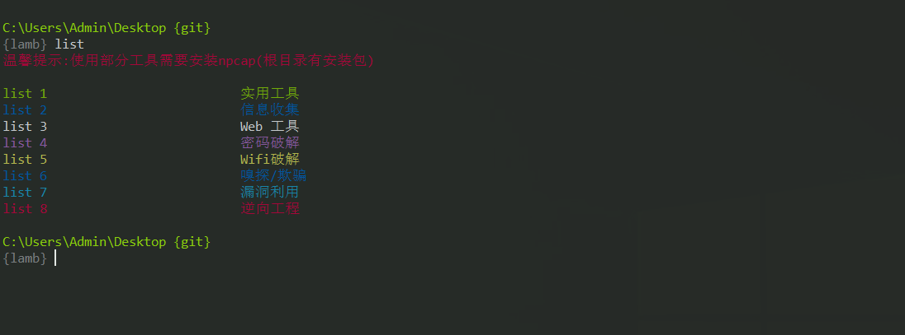

# 世界这么大，我想去看看

## Kali

[Kali Linux](https://www.kali.org/)是一个渗透测试兼安全审计平台，集成了多款漏洞检测、目标识别和漏洞利用工具，在信息安全业界有着广泛的用途。[这里](./Kali)是我使用它的一些总结，希望可以帮助到你。

## Treasure

Treasure “宝藏” 顾名思义这是收藏的珍宝，而且它并没有收集完毕，我还在不断的丰富它，这将是一个漫长的过程。如果你需要，[阅览](./Treasure)它或许可以帮助到你。

推荐链接：

- https://gtfobins.github.io/
- https://www.exploit-db.com/

## PentestBox

为了实现方便的渗透测试,我基于 PentestBox 制作了符合我自己的便捷式工具,你可以[点击这里](https://github.com/Lose002/Padipata/releases/download/v1.0/PentestBox.exe)下载它。

使用方式:

- 下载并安装到U盘

- 以管理员运行PentestBox

- list 查看工具列表

## VulnHub

[Vulnhub](https://www.vulnhub.com/)是一个面向公众开放的靶机平台，主旨是让任何人获得信息安全相关的实战经验。

下面是我完成的一些靶机，你可以学习它们。

- [Matrix-1](./VulnHub/Matrix-1.md)

- [HA:Dhanush](./VulnHub/HA-Dhanush.md)

- [bossplayersCTF](./VulnHub/bossplayersCTF.md)

- [Sunset:dawn](./VulnHub/Sunset-dawn.md)

- [Sunset:nightfall](./VulnHub/Sunset-nightfall.md)

- [Sunset](./VulnHub/Sunset.md)

- [symfonos-1](./VulnHub/symfonos-1.md)

- [symfonos-2](./VulnHub/symfonos-2.md)

- [symfonos-3](./VulnHub/symfonos-3.md)

- [symfonos-4](./VulnHub/symfonos-4.md)
## HackTheBox

[HackTheBox](https://www.hackthebox.eu/)是一个在线平台，允许你测试你的渗透测试技能，并与成千上万的安全领域的人交流思想和方法。

下面是我完成的一些靶机，你可以学习它们。

- [Craft](./HackTheBox/Craft.md)

- [Traverxec](./HackTheBox/Traverxec.md)
