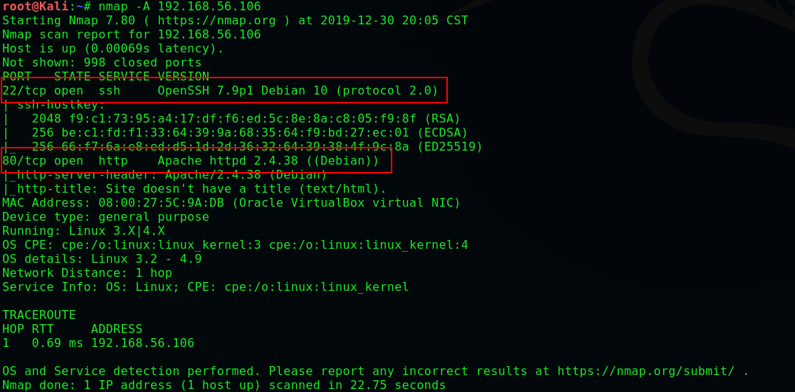
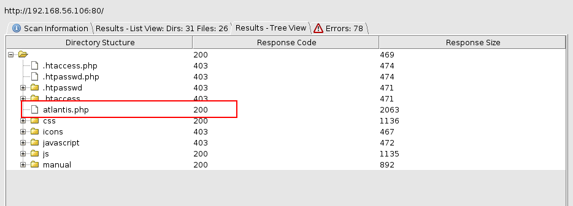
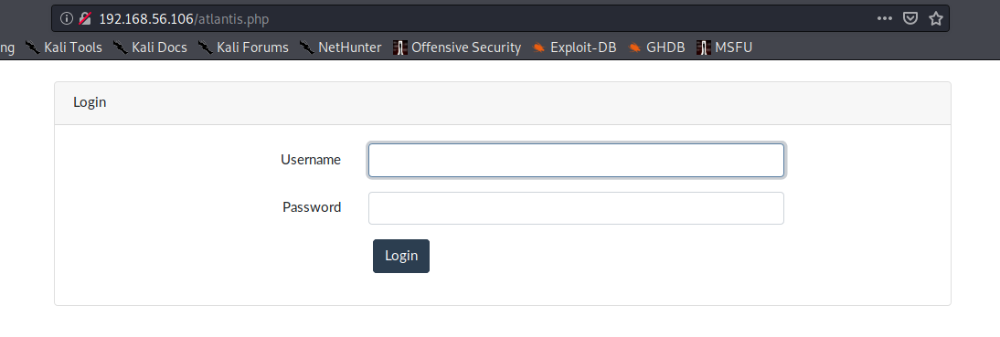

# symfonos-4

## 环境

虚拟机平台：Oracle VM VirtualBox

攻击机：Kali（IP：192.168.56.102）

靶机：symfonos-4（IP：192.168.56.106）

下载：https://www.vulnhub.com/entry/symfonos-4,347/

## Let's go

```
nmap -A 192.168.56.106
```



> **网站并无信息，进行枚举**





```

```

